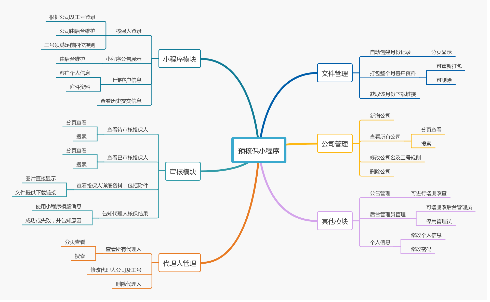
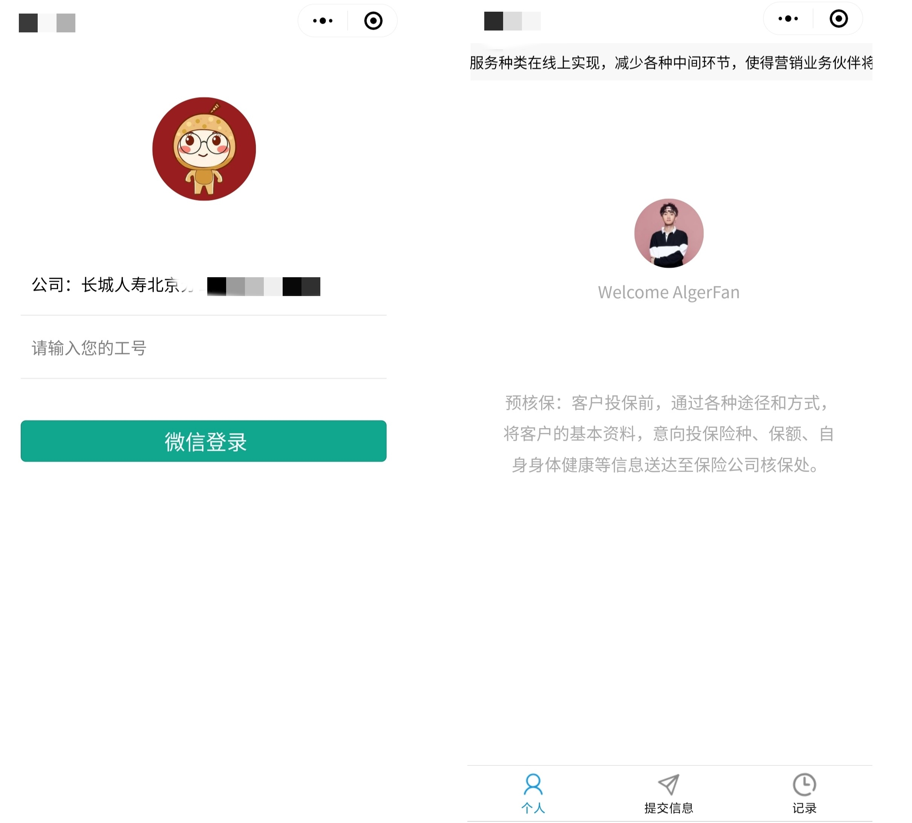
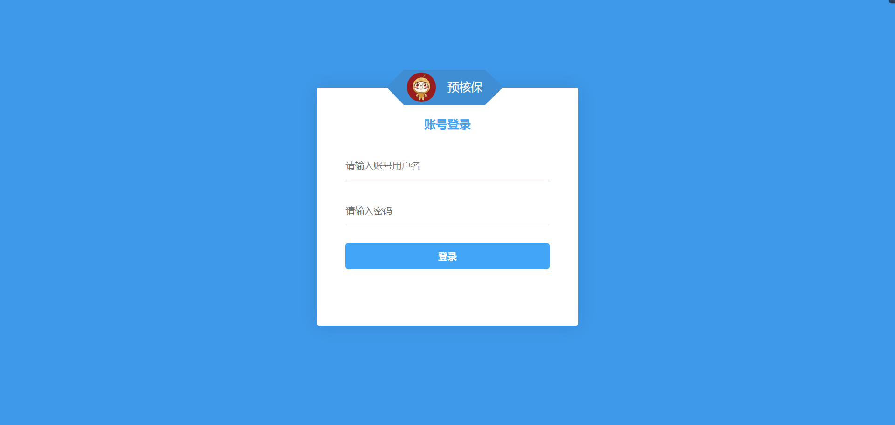
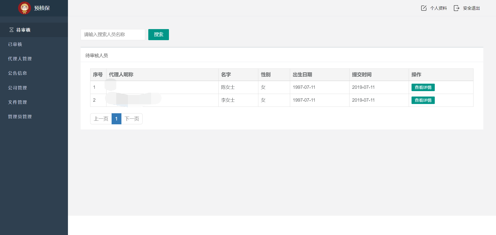
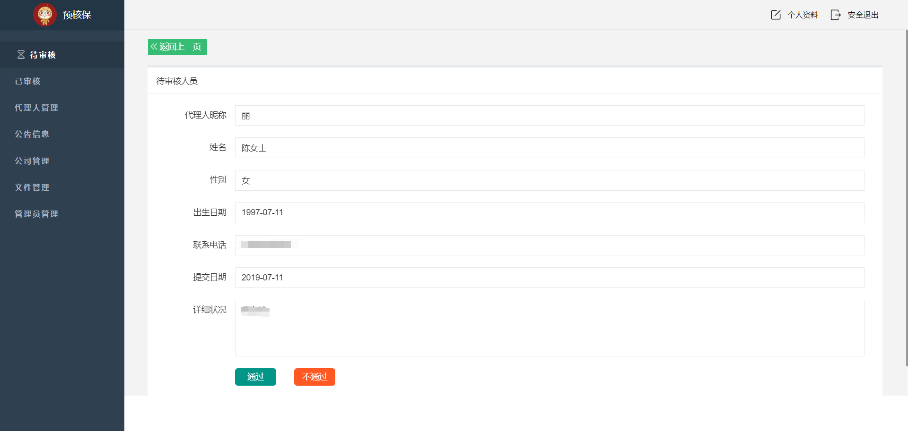
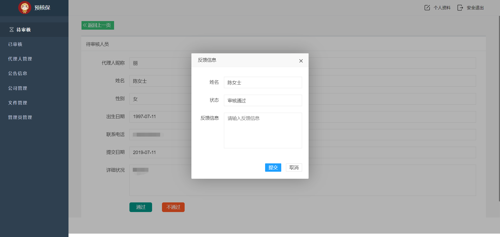
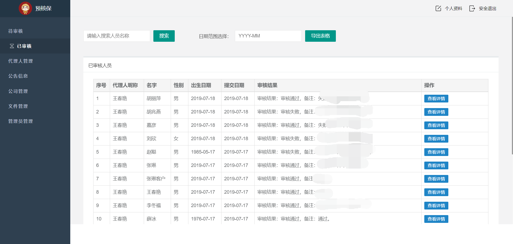
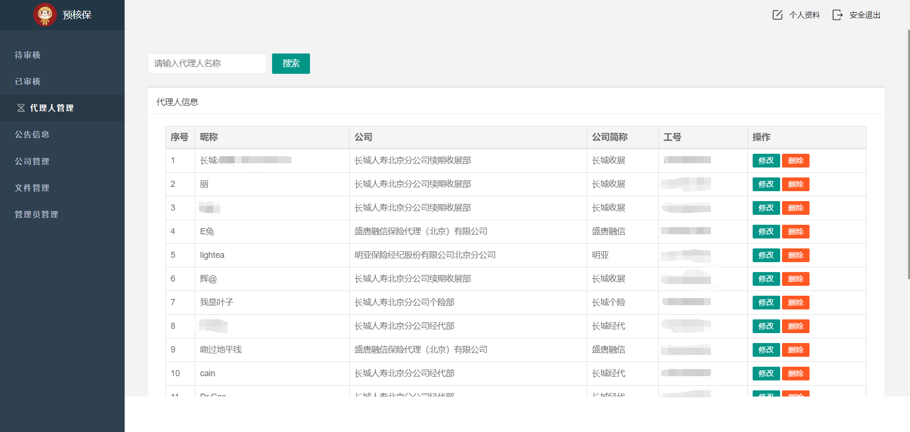
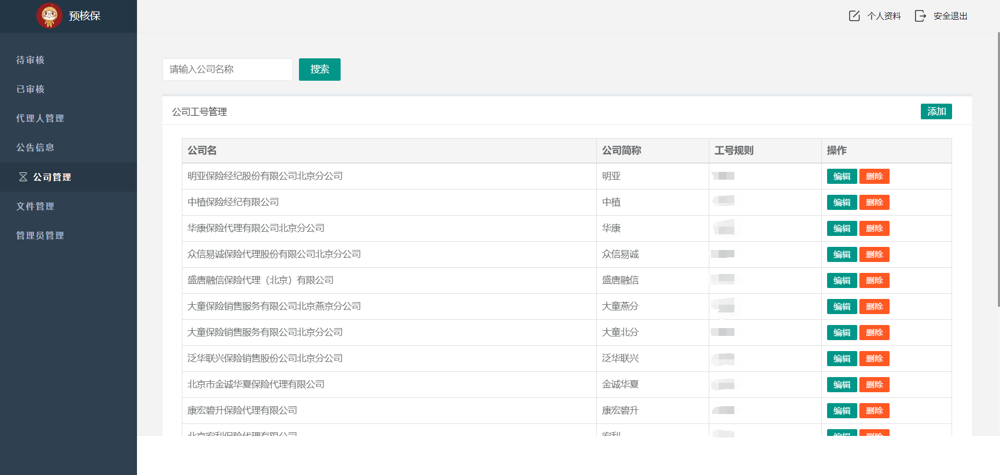
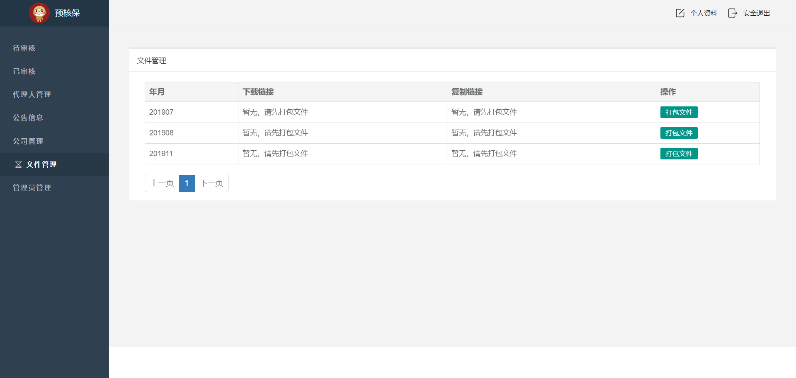

<h1 align="center">preliminary_underwriting</h1>

#### 项目介绍

预核保是在客户投保前，将客户基本资料、意向投保险种、保额、自身身体健康资料等信息通过小程序上传至预核保系统。小程序客户信息录入、附件上传，后台核保人员工作池、核保人员回复、工作量统计、公司管理、公告栏管理。

#### 模块介绍

#### 技术选型

后台技术选型

|                           框架                            |         说明         | 版本  |
| :-------------------------------------------------------: | :------------------: | :---: |
|   [Spring](https://spring.io/projects/spring-framework)   |     应用开发框架     | 5.0.0 |
|            [MySQL](https://www.mysql.com/cn/)             |     数据库服务器     |  5.7  |
| [MyBatis](http://www.mybatis.org/mybatis-3/zh/index.html) |    数据持久层框架    | 3.4.5 |
|       [BouncyCastle](https://www.bouncycastle.org/)       | 开源的加解密解决方案 | 1.56  |
|               [Poi](http://poi.apache.org/)               |     Office解析库     |  3.9  |
|             [jedis](https://redis.io/clients)             | 提供了完整Redis命令  | 2.7.3 |
|    [swagger-ui](https://swagger.io/tools/swagger-ui/)     |  swagger-ui接口文档  |  2.7  |
|          [Thymeleaf](https://www.thymeleaf.org/)          |  扩展性强的模板引擎  | 3.0.9 |

前台技术选型为微信小程序，依赖版本为：2.6.5

#### 部分页面展示

